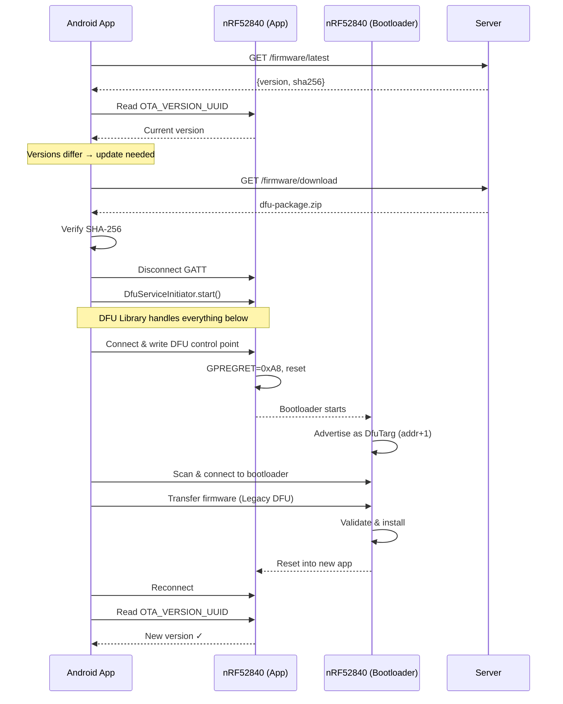

# OTA DFU Research: nRF52840 + Android (Kotlin/Gradle)

Research notes for implementing reliable OTA (Over-The-Air) firmware updates via Bluetooth Low Energy for the Seeed XIAO nRF52840, with an Android Kotlin companion app.

---

## Table of Contents

1. [Architecture Overview](#architecture-overview)
2. [Bootloader: Adafruit nRF52 Bootloader](#bootloader-adafruit-nrf52-bootloader)
3. [DFU Protocol: Legacy vs Secure](#dfu-protocol-legacy-vs-secure)
4. [Firmware Packaging (ZIP Format)](#firmware-packaging-zip-format)
5. [Android DFU Library](#android-dfu-library)
6. [End-to-End Update Flow](#end-to-end-update-flow)
7. [Known Issues & Pitfalls](#known-issues--pitfalls)
8. [Current Implementation Analysis](#current-implementation-analysis)
9. [Recommended Fixes](#recommended-fixes)
10. [References](#references)

---

## Architecture Overview

The OTA update chain has four layers:

```
┌──────────────────────────┐
│   Android Companion App  │  Nordic DFU Library (no.nordicsemi.android:dfu)
├──────────────────────────┤
│   BLE Transport (GATT)   │  Legacy DFU Service UUIDs
├──────────────────────────┤
│   Adafruit Bootloader    │  DFU mode (entered via BLEDfu / GPREGRET)
├──────────────────────────┤
│   nRF52840 Application   │  PlatformIO + Arduino (Adafruit nRF52 BSP)
└──────────────────────────┘
```

Key fact: The Seeed XIAO nRF52840 ships with the **Adafruit nRF52 Bootloader**, which implements the **Legacy DFU** protocol (nRF5 SDK ≤ v11 style), **not** Secure DFU. This is the single most important detail — it dictates the ZIP format, the Android library configuration, and the DFU service UUIDs.

---

## Bootloader: Adafruit nRF52 Bootloader

**Repository:** https://github.com/adafruit/Adafruit_nRF52_Bootloader

### What it does
- Provides DFU over serial (CDC/USB) and OTA (BLE)
- Also supports UF2 drag-and-drop flashing (application only)
- Uses the SoftDevice S140 v7.x (for nRF52840)
- Application base address: **0x27000** (after SoftDevice S140 v7)

### How the bootloader enters DFU mode

There are several ways:

| Method | Trigger |
|--------|---------|
| **GPREGRET register** | Application writes `0xA8` to `NRF_POWER->GPREGRET` then calls `NVIC_SystemReset()` — this is what `BLEDfu` does |
| **Double-tap reset** | Physical double-tap of the reset button (enters UF2 + CDC mode, not BLE DFU) |
| **DFU + FRST pins** | Both LOW = OTA DFU mode (board-specific) |

The `BLEDfu` class in the Adafruit Arduino BSP handles the "buttonless" DFU entry:
1. The phone writes to the DFU control point characteristic
2. The firmware sets `GPREGRET = 0xA8` and resets
3. The bootloader starts in OTA DFU mode
4. The bootloader advertises as `DfuTarg` (or similar) with **Legacy DFU Service UUID** `00001530-1212-efde-1523-785feabcd123`

### DFU BLE Service (in bootloader mode)

| Characteristic | UUID | Properties |
|---------------|------|------------|
| DFU Control Point | `00001531-1212-efde-1523-785feabcd123` | Write, Notify |
| DFU Packet | `00001532-1212-efde-1523-785feabcd123` | Write Without Response |
| DFU Version | `00001534-1212-efde-1523-785feabcd123` | Read |

### Bootloader advertising after reset

**Critical:** When the bootloader enters DFU mode, it advertises on a **different BLE address** (the original address + 1). The phone must **scan** for this new address. It does NOT re-use the same address as the application.

### PRN (Packet Receipt Notification)

The Adafruit bootloader requires PRN ≤ 8. If the Android DFU library sends more than 8 packets without a PRN, the bootloader runs out of buffer space and the transfer fails. The Nordic DFU library defaults to PRN = 0 (disabled) for Secure DFU but uses PRN for Legacy DFU — verify this is configured correctly.

---

## DFU Protocol: Legacy vs Secure

| Feature | Legacy DFU (SDK ≤ 11) | Secure DFU (SDK 12+) |
|---------|----------------------|---------------------|
| **Used by** | Adafruit bootloader ✅ | Nordic SDK 12+ bootloader |
| **Init packet** | Optional (CRC-based) | Required (protobuf, signed) |
| **Service UUID** | `00001530-1212-efde-1523-785feabcd123` | `FE59` (buttonless) |
| **Signing** | Not required (optional in Adafruit) | Required (ed25519/ECDSA) |
| **ZIP format** | `adafruit-nrfutil dfu genpkg` | `nrfutil pkg generate` |
| **Bootloader address** | Original + 1 | Original + 1 (unbonded) or same (bonded) |

**The Adafruit bootloader uses Legacy DFU.** The Android DFU library supports both, but configuration differs.

> ⚠️ **Important:** Do NOT use `nrfutil` (Nordic's current tool) to generate DFU packages for the Adafruit bootloader. Use `adafruit-nrfutil` instead — the init packet format is different.

---

## Firmware Packaging (ZIP Format)

### Tool: adafruit-nrfutil

```bash
pip install adafruit-nrfutil
```

### Generating a DFU ZIP package

From a `.hex` file (PlatformIO build output):

```bash
adafruit-nrfutil dfu genpkg \
    --dev-type 0x0052 \
    --application .pio/build/nrf52840/firmware.hex \
    dfu-package.zip
```

From a `.bin` file (must specify the application base address):

```bash
adafruit-nrfutil dfu genpkg \
    --dev-type 0x0052 \
    --application .pio/build/nrf52840/firmware.bin \
    --application-address 0x27000 \
    dfu-package.zip
```

### ZIP file contents

The generated ZIP contains:

```
dfu-package.zip
├── firmware.bin          # Raw application binary
├── firmware.dat          # Init packet (device type, CRC, etc.)
└── manifest.json         # Describes the package contents
```

Example `manifest.json`:
```json
{
  "manifest": {
    "application": {
      "bin_file": "firmware.bin",
      "dat_file": "firmware.dat",
      "init_packet_data": {
        "application_version": 0xFFFFFFFF,
        "device_revision": 0xFFFF,
        "device_type": 0x0052,
        "firmware_crc16": 0x1234,
        "softdevice_req": [0xFFFE]
      }
    }
  }
}
```

### What the server must serve

The `/firmware/download` endpoint must serve this **ZIP file** — not a raw `.bin` or `.hex`. The Nordic DFU library on Android expects a ZIP with the manifest and init packet.

---

## Android DFU Library

**Repository:** https://github.com/NordicSemiconductor/Android-DFU-Library

### Dependency

```kotlin
// build.gradle.kts
implementation("no.nordicsemi.android:dfu:2.4.2")
```

> ⚠️ **Version warning:** There is an [open bug (issue #491)](https://github.com/NordicSemiconductor/Android-DFU-Library/issues/491) where **DFU library v2.9.0 breaks Legacy DFU**. The failure manifests as "OPERATION FAILED" (status 6) when sending firmware. **Stick with v2.4.2 or v2.8.0** for Legacy DFU until this is resolved.

### Required Android components

1. **DfuService** — extends `DfuBaseService`:

```kotlin
class DfuService : DfuBaseService() {
    override fun getNotificationTarget(): Class<out Activity> = OtaUpdateActivity::class.java

    override fun onCreate() {
        super.onCreate()
        // Create notification channel (required Android 8+)
        val channel = NotificationChannel(
            NOTIFICATION_CHANNEL_DFU, "Firmware Update",
            NotificationManager.IMPORTANCE_LOW
        )
        getSystemService(NotificationManager::class.java)
            .createNotificationChannel(channel)
    }
}
```

2. **AndroidManifest.xml** — register the service:

```xml
<service
    android:name=".DfuService"
    android:exported="false"
    android:foregroundServiceType="connectedDevice" />
```

3. **Required permissions:**

```xml
<uses-permission android:name="android.permission.BLUETOOTH_CONNECT" />
<uses-permission android:name="android.permission.BLUETOOTH_SCAN"
    android:usesPermissionFlags="neverForLocation" />
<uses-permission android:name="android.permission.FOREGROUND_SERVICE" />
<uses-permission android:name="android.permission.FOREGROUND_SERVICE_CONNECTED_DEVICE" />
```

### Starting a DFU transfer

```kotlin
// CRITICAL: Disconnect your app's GATT connection first!
// The DFU library manages its own connection.
bleService.disconnectDevice(deviceAddress)

DfuServiceInitiator(deviceAddress)
    .setDeviceName("IsChrisVaping")
    .setZip(Uri.fromFile(zipFile))  // Must be a ZIP, not raw bin!
    // Adafruit bootloader uses address+1 in DFU mode
    .setForceScanningForNewAddressInLegacyDfu(true)
    // Optional but recommended:
    .setNumberOfRetries(3)
    .setPacketsReceiptNotificationsEnabled(true)
    .setPacketsReceiptNotificationsValue(8)  // Adafruit bootloader limit
    .start(context, DfuService::class.java)
```

### Progress listener

```kotlin
private val dfuProgressListener = object : DfuProgressListenerAdapter() {
    override fun onDfuProcessStarted(deviceAddress: String) { }
    override fun onProgressChanged(deviceAddress: String, percent: Int,
                                    speed: Float, avgSpeed: Float,
                                    currentPart: Int, partsTotal: Int) { }
    override fun onDfuCompleted(deviceAddress: String) { }
    override fun onError(deviceAddress: String, error: Int,
                         errorType: Int, message: String) { }
}

// Register in onResume, unregister in onPause
DfuServiceListenerHelper.registerProgressListener(activity, dfuProgressListener)
DfuServiceListenerHelper.unregisterProgressListener(activity, dfuProgressListener)
```

---

## End-to-End Update Flow

### Build & Package (CI/Developer)

```
1. pio run -e nrf52840
   → Produces: .pio/build/nrf52840/firmware.hex

2. adafruit-nrfutil dfu genpkg --dev-type 0x0052 --application firmware.hex dfu-package.zip
   → Produces: dfu-package.zip (contains firmware.bin + firmware.dat + manifest.json)

3. Upload ZIP to server:
   curl -X POST "https://server/firmware/upload?version=1.2.3" \
        -H "Authorization: Bearer $TOKEN" \
        -F "file=@dfu-package.zip"
```

### OTA Update (Android App → Device)

```
1. App reads device firmware version via custom OTA_VERSION_UUID characteristic
2. App fetches /firmware/latest from server → gets latest version + sha256
3. If versions differ, user taps "Update"
4. App downloads /firmware/download → receives the ZIP file
5. App verifies SHA-256 checksum
6. App disconnects its GATT connection to the device
7. App starts DfuServiceInitiator with the ZIP file
8. DFU library:
   a. Connects to device
   b. Writes to BLEDfu control point → triggers bootloader entry (GPREGRET=0xA8 + reset)
   c. Device resets into bootloader, advertises as DfuTarg on address+1
   d. Library scans for and connects to bootloader
   e. Transfers firmware via Legacy DFU protocol
   f. Bootloader validates and installs firmware
   g. Device resets into new application
9. App reconnects and reads new firmware version to confirm
```

### Sequence Diagram



---

## Known Issues & Pitfalls

### 1. ZIP format mismatch (most likely cause of failure)

**Problem:** The server stores/serves a raw `.bin` file, but the DFU library expects a properly formatted ZIP with `manifest.json` and an init packet (`.dat` file).

**Symptom:** DFU fails immediately with "Invalid firmware" or the bootloader rejects the transfer.

**Fix:** Always use `adafruit-nrfutil dfu genpkg` to create the ZIP. Upload and serve the ZIP, not the raw binary.

### 2. Using `nrfutil` instead of `adafruit-nrfutil`

**Problem:** Nordic's `nrfutil` (for Secure DFU / nRF Connect SDK) generates a different init packet format than what the Adafruit bootloader expects.

**Symptom:** Bootloader rejects the init packet; DFU fails during validation.

**Fix:** Install and use `adafruit-nrfutil`:
```bash
pip install adafruit-nrfutil
adafruit-nrfutil dfu genpkg --dev-type 0x0052 --application firmware.hex package.zip
```

### 3. Bootloader address change

**Problem:** The Adafruit bootloader advertises on BLE address+1 when in DFU mode. If the DFU library doesn't scan for the new address, it can't connect.

**Fix:** Set `.setForceScanningForNewAddressInLegacyDfu(true)` on the `DfuServiceInitiator`.

### 4. GATT connection conflict

**Problem:** If the app's GATT connection is still active when the DFU library tries to connect, the DFU fails.

**Fix:** Explicitly disconnect and close the app's `BluetoothGatt` before starting DFU:
```kotlin
bleService.disconnectDevice(address)
bluetoothGatt = null
// Small delay may help on some Android versions
Thread.sleep(500)
DfuServiceInitiator(address)...start(...)
```

### 5. PRN (Packet Receipt Notification) overflow

**Problem:** The Adafruit bootloader has limited buffer space and requires PRN ≤ 8. If the DFU library sends too many packets without waiting for a receipt notification, the bootloader drops packets.

**Fix:**
```kotlin
DfuServiceInitiator(address)
    .setPacketsReceiptNotificationsEnabled(true)
    .setPacketsReceiptNotificationsValue(8)  // Max for Adafruit bootloader
```

### 6. DFU library version > 2.8.0 breaks Legacy DFU

**Problem:** [GitHub issue #491](https://github.com/NordicSemiconductor/Android-DFU-Library/issues/491) reports that DFU library v2.9.0+ causes "OPERATION FAILED" (status 6) when using Legacy DFU. The issue is still open.

**Fix:** Pin to `no.nordicsemi.android:dfu:2.4.2` (or 2.8.0 max) until resolved.

### 7. Bonding and IRK sharing

**Problem:** Modern Android devices use random resolvable BLE addresses. After the device reboots into the bootloader, the bootloader may not be able to resolve the phone's address without a shared IRK (Identity Resolving Key).

**Mitigation:** The firmware already enables bonding with Just Works pairing via:
```cpp
Bluefruit.Security.setIOCaps(false, false, false);
Bluefruit.Security.setMITM(false);
```
This shares the IRK during pairing. However, since the Adafruit bootloader advertises on address+1 and the DFU library scans for it, this is less of an issue for Legacy DFU than for Secure DFU.

### 8. SoftDevice version mismatch

**Problem:** The DFU package can specify required SoftDevice versions. If the running SoftDevice doesn't match, the bootloader rejects the package.

**Fix:** Use `--sd-req 0xFFFE` (wildcard) in the `adafruit-nrfutil` command, or determine the exact SoftDevice version from the board's bootloader release notes. For S140 v7.3.0, the ID is `0x0123`.

```bash
adafruit-nrfutil dfu genpkg --dev-type 0x0052 --sd-req 0xFFFE --application firmware.hex package.zip
```

---

## Current Implementation Analysis

### What's in place (working)

| Component | Status | Notes |
|-----------|--------|-------|
| Firmware: `BLEDfu` service | ✅ | Initialized in `bluetooth.cpp` before advertising |
| Firmware: Version characteristic | ✅ | Read-only, serves `FIRMWARE_VERSION` string |
| Android: `DfuService` wrapper | ✅ | Properly extends `DfuBaseService` |
| Android: `DfuServiceInitiator` | ✅ | Uses `.setZip()` and `.setForceScanningForNewAddressInLegacyDfu(true)` |
| Android: GATT disconnect before DFU | ✅ | Calls `bleService.disconnectDevice(address)` |
| Android: Progress listener | ✅ | Properly registered/unregistered |
| Android: Manifest permissions | ✅ | All required permissions present |
| Server: Upload/download/latest endpoints | ✅ | Version + SHA-256 verification |

### What's likely broken

| Issue | Severity | Details |
|-------|----------|---------|
| **Server serves raw `.bin`, not DFU ZIP** | 🔴 Critical | The upload endpoint saves the file as `firmware.bin`. The download endpoint serves it as a raw binary. But the DFU library needs a ZIP with `manifest.json` + init packet. The Android app saves it as `firmware_dfu.zip` but it's actually just a renamed `.bin` — it has no manifest or init packet inside. |
| **No `adafruit-nrfutil` in build pipeline** | 🔴 Critical | There is no step to run `adafruit-nrfutil dfu genpkg` to create a proper DFU package. |
| **PRN not configured** | 🟡 Medium | `DfuServiceInitiator` doesn't set PRN value. The Adafruit bootloader needs PRN ≤ 8. Default behavior may work, but explicit configuration is safer. |
| **No retries configured** | 🟡 Medium | `setNumberOfRetries()` is not called. BLE transfers can be flaky; 2-3 retries is recommended. |

---

## Recommended Fixes

### Fix 1: Build pipeline — generate proper DFU ZIP

Add a Makefile target or CI step:

```makefile
# In firmware/nrf52840/Makefile or project root Makefile
dfu-package:
	cd firmware/nrf52840 && pio run -e nrf52840
	adafruit-nrfutil dfu genpkg \
		--dev-type 0x0052 \
		--sd-req 0xFFFE \
		--application firmware/nrf52840/.pio/build/nrf52840/firmware.hex \
		dfu-package.zip
	@echo "DFU package created: dfu-package.zip"
```

### Fix 2: Server — upload and serve ZIP files

The server upload/download endpoints should handle ZIP files rather than raw binaries:

- Upload: accept `.zip`, store as `firmware.zip`
- Download: serve `firmware.zip` with `Content-Type: application/zip`
- Latest: metadata stays the same (version, sha256, size)

### Fix 3: Android — configure DFU initiator properly

```kotlin
DfuServiceInitiator(address)
    .setDeviceName("IsChrisVaping")
    .setZip(Uri.fromFile(tempFile))
    .setForceScanningForNewAddressInLegacyDfu(true)
    .setNumberOfRetries(3)
    .setPacketsReceiptNotificationsEnabled(true)
    .setPacketsReceiptNotificationsValue(8)
    .start(this, DfuService::class.java)
```

### Fix 4: Version injection at build time

The firmware `FIRMWARE_VERSION` is currently `"<dev>"`. The CI pipeline should substitute this:

```bash
# In CI, before building:
sed -i 's/<dev>/1.2.3/' firmware/nrf52840/src/version.h
```

Or use a PlatformIO build flag:
```ini
# platformio.ini
build_flags = -DFIRMWARE_VERSION='"1.2.3"'
```

---

## References

| Resource | URL |
|----------|-----|
| Adafruit nRF52 Bootloader | https://github.com/adafruit/Adafruit_nRF52_Bootloader |
| adafruit-nrfutil (packaging tool) | https://github.com/adafruit/Adafruit_nRF52_nrfutil |
| Nordic Android DFU Library | https://github.com/NordicSemiconductor/Android-DFU-Library |
| DFU Library documentation | https://github.com/NordicSemiconductor/Android-DFU-Library/blob/main/documentation/README.md |
| DFU Library v2.9.0 Legacy DFU bug | https://github.com/NordicSemiconductor/Android-DFU-Library/issues/491 |
| Seeed XIAO nRF52840 | https://wiki.seeedstudio.com/XIAO_BLE/ |
| Nordic DFU overview | https://infocenter.nordicsemi.com/topic/sdk_nrf5_v17.1.0/lib_bootloader_modules.html |
